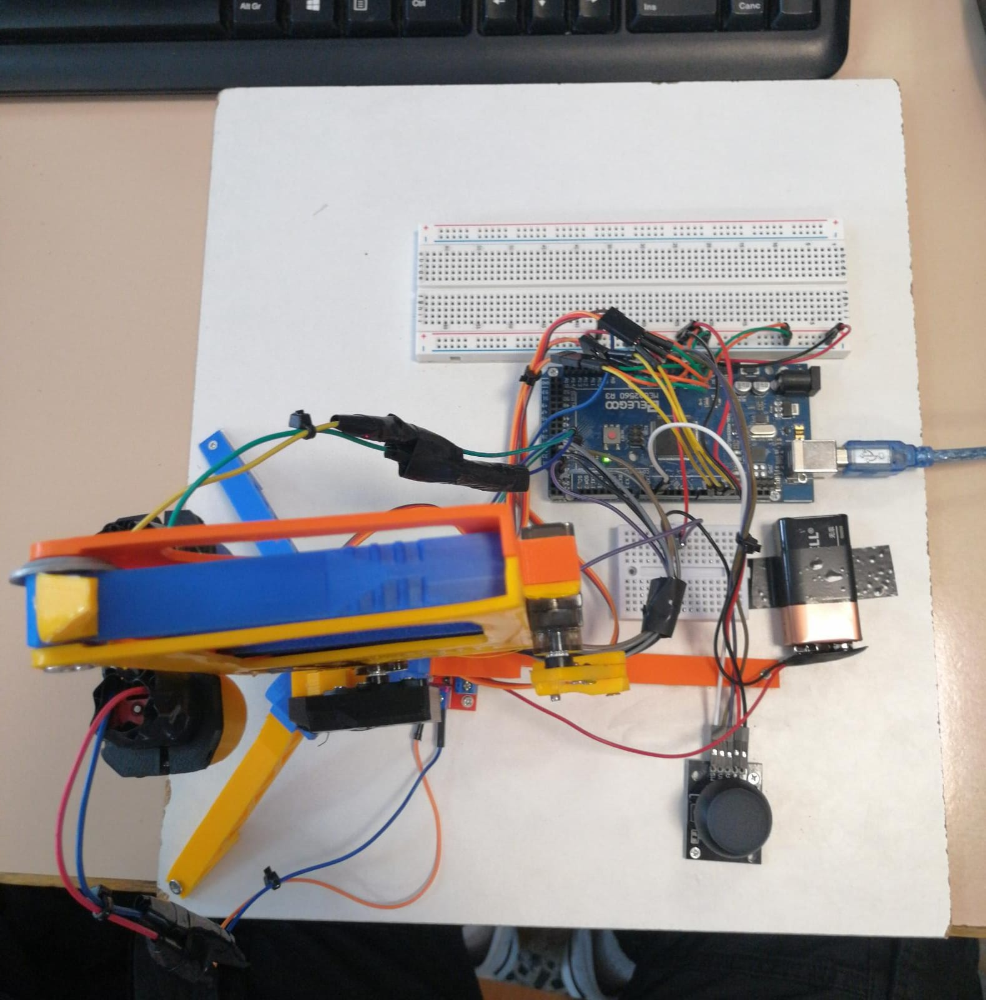
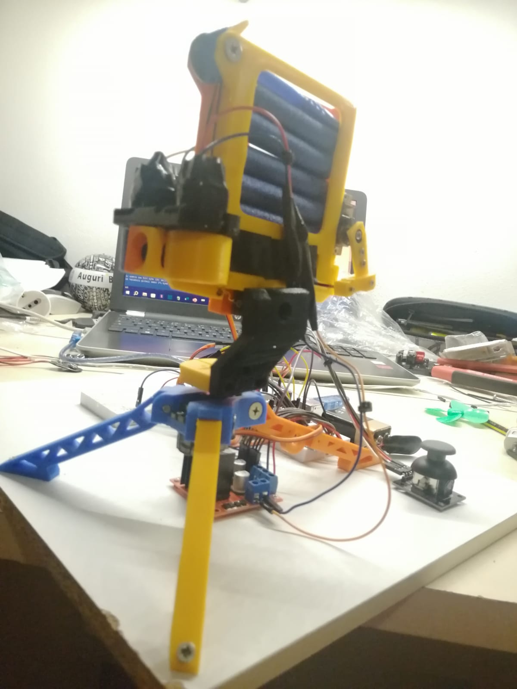

# 🛡️ Progetto Torretta Automatizzata Arduino (5° Liceo Scientifico)

[](https://github.com/andreee5/Torretta_Automatizzata_Arduino/releases/latest)


Progetto scolastico sviluppato durante il quinto anno di liceo scientifico, incentrato sulla realizzazione fisica e software di una **torretta automatizzata sparadardi** controllata via **Arduino**.

---

## 📖 Descrizione del progetto

Il progetto consiste in una torretta automatizzata capace di lanciare dardi simili a quelli dei blaster Nerf, progettata per:

* **Puntare su due assi (X e Y)**
* **Sparare dardi tramite un meccanismo elettromeccanico**
* **Essere controllata manualmente tramite joystick**

Il lavoro è stato realizzato in gruppo, ma ho avuto un **ruolo centrale nello sviluppo tecnico**, sia hardware che software.

---

## 🧰 Componenti e funzionalità

* **Arduino Mega** come unità centrale di controllo
* **2 Servo motori** per il movimento orizzontale e verticale (2 DOF)
* **Joystick analogico** per il controllo manuale in tempo reale
* **2 motori DC controrotanti** per generare l’attrito e lanciare il dardo
* **1 Servo aggiuntivo** per inserire meccanicamente il dardo tra i motori DC
* **Struttura stampata in 3D** per integrare tutti i componenti

---

## ⚙️ Funzionamento

1. Il joystick muove la torretta:

   * **Asse X**: destra/sinistra
   * **Asse Y**: su/giù
2. **Premendo il joystick (pulsante), un servo posiziona il dardo** tra i motori
3. I **motori DC ruotano in senso opposto**, generando attrito e lanciando il dardo
4. Tutto è controllato da codice scritto su **Arduino IDE**, con logica di controllo personalizzata

---

## 🎓 Competenze sviluppate

* Programmazione **embedded** su Arduino IDE
* Controllo di **attuatori** (servo e DC motor)
* Gestione di **input analogico** (joystick)
* Integrazione **meccatronica**: elettronica + meccanica + software
* Esperienza diretta con automazione fisica
* Lavoro di gruppo con responsabilità tecnica autonoma

---

## 🖼️ Foto del progetto

### 🔌 Componenti interni collegati alla base



### 🎯 Vista frontale della torretta completata



---

## 🎞️ Dimostrazione funzionamento

> Clip animata che mostra il comportamento reale della torretta in fase di controllo e sparo:


---

## 📁 File inclusi nel progetto

```
Torretta_Automatizzata_Arduino/
├── codice/
│   └── torretta.ino
├── media/
│   ├── foto_torretta_arduino_componenti.jpg
│   ├── foto_torretta_arduino_frontale.jpg
│   └── Video_torretta_arduino_funzionamento.gif
├── LICENSE
├── README.md
└── .gitignore
```

---

## 📌 Come usare il codice

1. Apri il file `torretta.ino` in **Arduino IDE**
2. Collega Arduino secondo lo schema presente
3. Carica lo sketch sulla scheda
4. Alimenta Arduino (via USB o esterno)
5. Usa il joystick per controllare la torretta

---

## 👨‍💻 Autore

**Andrea Sartoni**
Ruolo centrale nello sviluppo elettronico, logico e software della torretta

---

## 📄 Licenza

Distribuito sotto licenza **MIT**. Consulta il file `LICENSE` per i dettagli.
